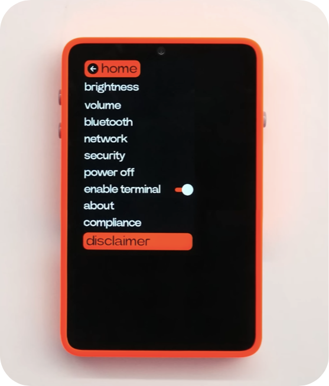

# turtle 🐢

On-device AI Assistant to work with vision & text based language models for getting more from devices that you already own!  

> "This should be an app" - Dave2D

  

### Goals

- [ ] Incorporate Moondream2 with Llama.cpp's Android example

- [ ] Incorporate JetMoE or Phi-3 for text based tasks - summarization, entity extraction, function/intent invocation across apps

- [ ] Vision &/DOM based control of accessing websites

- [ ] Add OpenCL support

- [ ] Whisper & TTS support
